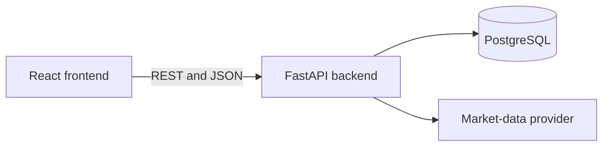

# Application Architecture

## Overview

The Portfolio Analytics Platform uses a three-tier architecture:

1. A React and TypeScript frontend presents portfolio data and collects user input.
2. A FastAPI backend validates requests, applies business logic, and exposes a REST API.
3. PostgreSQL stores portfolios, assets, transactions, and cached market prices.



## Current Components

### Frontend

The frontend is located in `frontend/` and uses React, TypeScript, and Vite.

### Backend

The backend is located in `backend/`. FastAPI currently exposes a health-check endpoint at:

```text
GET /api/v1/health
```

### Database

PostgreSQL runs locally through Docker Compose. The database container is defined in `compose.yaml`.

## Design Decisions

- Frontend and backend code are kept in one repository to simplify development and documentation.
- Backend dependencies are isolated inside a Python virtual environment.
- PostgreSQL runs in Docker to provide a reproducible development environment.
- Application configuration will use environment variables.
- Market-data integrations will be isolated behind an adapter so providers can be changed without rewriting business logic.
- Portfolio holdings will eventually be derived from transaction history instead of stored as mutable totals.